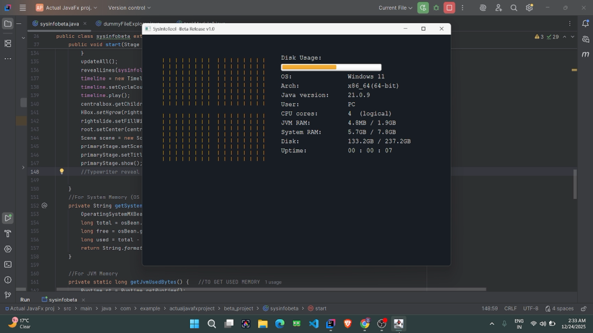

# ⚡ System-Info-Tool

> Lightweight realtime system monitoring utility built with JavaFX  
> Inspired by terminal aesthetics, neofetch, and low-level system telemetry.



---

# ✨ Features

- ⚡ Realtime system monitoring
- 🧠 JVM memory usage tracking
- 💾 Live disk usage analysis
- 🖥 Operating system detection
- 🧩 CPU architecture detection
- ⏱ JVM uptime monitoring
- 🎨 Minimal hacker-inspired UI
- 🧵 Timeline-based live refresh engine
- ☕ Built entirely using Java + JavaFX

---

# 🖼 Interface

The UI is heavily inspired by:

- terminal dashboards
- neofetch
- cyberpunk aesthetics
- lightweight desktop telemetry tools

Designed with:
- dark minimalist visuals
- monospace typography
- realtime updating components
- lightweight rendering

---

# 🛠 Built With

| Technology | Purpose |
|---|---|
| Java | Core application logic |
| JavaFX | Desktop UI framework |
| Maven | Build system |
| JVM Runtime APIs | Memory + uptime telemetry |
| FileStore APIs | Disk monitoring |

---

# 📊 Monitored Information

The application currently displays:

- Operating System
- CPU Architecture
- Java Runtime Version
- Current User
- Logical CPU Cores
- JVM Memory Usage
- System RAM Usage
- Disk Usage
- JVM Uptime

---

# 🚀 Running The Project

## Clone Repository

```bash
git clone https://github.com/nildb-io/System-Info-Tool.git
cd System-Info-Tool

---
📂 Project Structure
System-Info-Tool/
├── .mvn/
├── screenshots/
├── src/
│   └── main/
│       ├── java/
│       └── resources/
├── .gitignore
├── mvnw
├── mvnw.cmd
└── pom.xml
